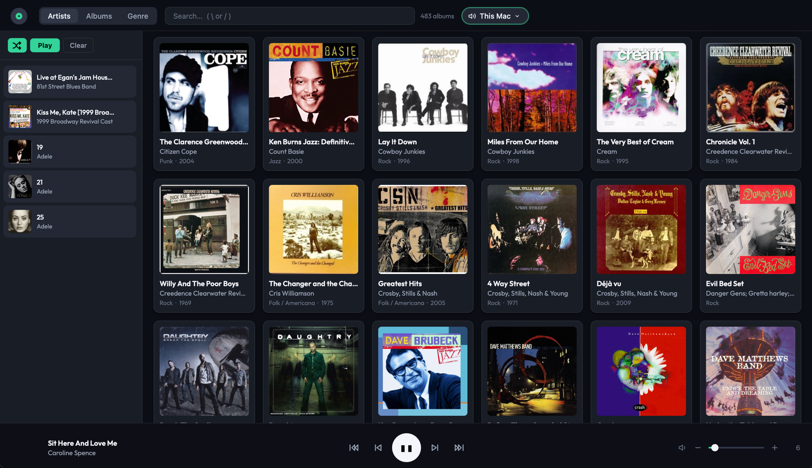

# Sonos Album Player

A self-hosted web app for browsing your music library by album and playing through Sonos — or directly on the device you're using (iPhone, Mac, etc.).

**Designed by Alan Marks. Built with [Claude](https://claude.ai).** Bug reports and pull requests welcome — see [CONTRIBUTING](CONTRIBUTING.md).



---

## Features

- Browse your library by album cover art, sorted by artist, album, or genre
- Search and filter
- Drag albums onto the queue, reorder, remove individual tracks
- Full Sonos group/speaker switching and playback controls
- **Local device playback** — play directly in the browser on any device (iPhone, Mac, etc.) with lock screen and CarPlay controls via the MediaSession API
- Sonos auto-discovery — no need to know your speaker's IP address
- Incremental library scanning (re-scan only picks up what changed)
- Dark UI, mobile-friendly

## Requirements

- Python 3.8 or newer (tested on 3.8, 3.11, and 3.14)
- A Sonos system (for Sonos playback; local device playback works without one)
- Music files in MP3, FLAC, or M4A format
- The machine running the app must be able to read your music files

The app runs as a plain Python process — no Docker required, though a Dockerfile and Compose file are included if you prefer containers (see [Docker](#docker-optional) below).

## Setup

**1. Clone and install dependencies**

```bash
git clone https://github.com/amarks/sonos-album-player.git
cd sonos-album-player
python3 -m venv .venv
source .venv/bin/activate   # Windows: .venv\Scripts\activate
pip install -r requirements.txt
```

**2. Configure**

```bash
cp config.json.example config.json
```

Edit `config.json`:

```json
{
  "sonos_ip": "",
  "music_directory": "/path/to/your/music",
  "database_path": "./sonos_albums.db",
  "port": 5100,
  "items_per_page": 1000
}
```

- `sonos_ip` — leave blank to use auto-discovery. The app will find your Sonos and cache the IP automatically. You can set it explicitly (e.g. `"192.168.1.100"`) to skip the discovery delay on startup.
- `music_directory` — the root folder containing your music. The scanner walks it recursively, treating each folder as one album.

**3. Scan your library**

```bash
python3 app.py scan
```

This reads your music files, extracts metadata and cover art, and populates the database. A library of a few thousand albums takes a minute or two.

**4. Start the app**

```bash
python3 app.py
```

Open `http://localhost:5100` in your browser.

## Running on a home server or NAS

The app is designed to run as a background process on an always-on machine (NAS, Raspberry Pi, old Mac mini, etc.) so it's available from any device on your network.

**Simple background start:**

```bash
nohup .venv/bin/python app.py > app.log 2>&1 &
```

**As a systemd service** (Linux):

Create `/etc/systemd/system/sonos-album-player.service`:

```ini
[Unit]
Description=Sonos Album Player
After=network.target

[Service]
Type=simple
User=your-username
WorkingDirectory=/path/to/sonos-album-player
ExecStart=/path/to/sonos-album-player/.venv/bin/python app.py
Restart=always

[Install]
WantedBy=multi-user.target
```

```bash
sudo systemctl enable sonos-album-player
sudo systemctl start sonos-album-player
```

Once running, access it from any device on your network at `http://<server-ip>:5100` (e.g. `http://192.168.1.50:5100`).

## Docker (optional)

A `Dockerfile` and `docker-compose.yml` are included. Only works on Linux hosts — Sonos discovery uses SSDP multicast, which requires `network_mode: host`, and Docker Desktop on macOS/Windows doesn't support host networking the same way.

**1. Prepare config**

```bash
cp config.json.example config.json
```

Edit `config.json` for the container's mount paths:

```json
{
  "sonos_ip": "",
  "music_directory": "/music",
  "database_path": "/data/sonos_albums.db",
  "port": 5100,
  "items_per_page": 1000
}
```

Also edit the music-library bind mount in `docker-compose.yml` (`/volume1/music` → wherever your files live) and create the data dir:

```bash
mkdir data
```

**2. Build and start**

```bash
docker compose up -d
```

**3. Scan the library** (first run and after adding music)

```bash
docker compose exec sonos-player python app.py scan
```

Then browse to `http://<host-ip>:5100`.

## Usage

**Sonos playback**

Select a Sonos room or group from the speaker dropdown. Drag albums into the queue, then hit Play. The queue persists across sessions.

**Local device playback**

Select "This iPhone", "This Mac", etc. from the speaker dropdown. The queue is independent from your Sonos queue — both can run at the same time. On iPhone with CarPlay connected, the Now Playing screen and steering wheel controls work automatically.

**Re-scanning after adding music**

```bash
python3 app.py scan
```

Run without `--full` for a fast incremental scan (skips unchanged folders). Add `--full` to rebuild everything from scratch.

## Troubleshooting

**Sonos not found**

Auto-discovery uses multicast, which can occasionally be blocked by network configuration. If discovery fails, find your Sonos IP (Sonos app → Settings → System → About My System) and set `sonos_ip` in `config.json` (e.g. `"192.168.1.100"`). Make sure the machine running the app and your Sonos speakers are on the same network.

**Music won't play through Sonos**

Sonos plays files directly from your network — it doesn't stream through this app. Your music folder needs to be accessible to Sonos as a network share (SMB/NFS). Set that up in the Sonos app under Settings → System → Music Library.

**Albums missing or cover art not showing**

Run `python3 app.py scan` to pick up any new files. Cover art is read from embedded tags (MP3/FLAC/M4A) or from a `cover.jpg` / `folder.jpg` file in the album directory.

**FLAC albums not appearing**

Make sure your FLAC files have an `ALBUM` Vorbis comment tag. Files without an album tag are skipped during scanning.

## Architecture

- **Backend**: Flask (`app.py`) — all API endpoints in one file
- **Frontend**: `templates/index.html` — all CSS and JS inline, no build step
- **Database**: SQLite for album/track metadata and cover art
- **Sonos control**: [soco](https://github.com/SoCo/SoCo) library
- **Audio tagging**: [mutagen](https://mutagen.readthedocs.io/)

## License

[MIT](LICENSE) &copy; 2026 Alan Marks
